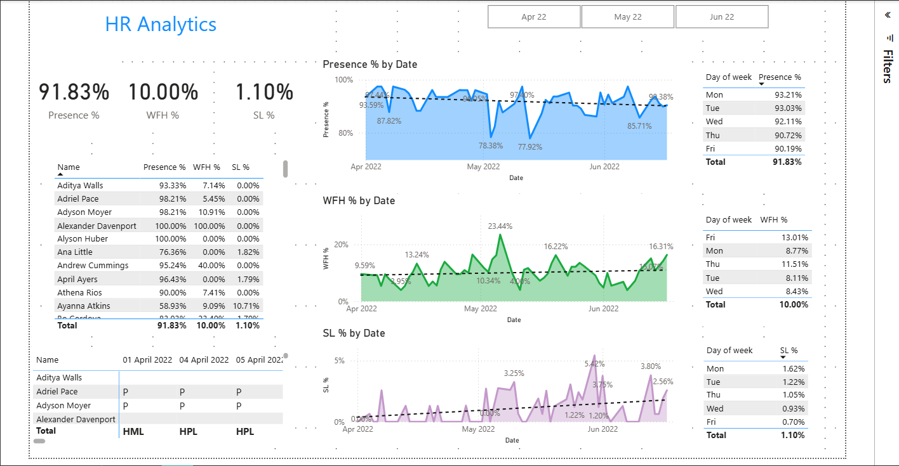

# HR Analytics Dashboard using Power BI

##  Project Overview
This project presents an **HR Analytics Dashboard** built in **Power BI** to analyze workforce data, uncover insights, and support data-driven HR decisions.  
The dashboard provides a comprehensive view of key HR metrics such as attendance, work-from-home patterns, and leave trends, enabling effective workforce management.

---

##  Key Highlights
- **Executed a comprehensive HR analytics project** in Power BI, revealing trends, insights, and actionable metrics for effective workforce management.  
- **Built an interactive dashboard** displaying both company-wide and individual employee metrics.  
- **Analyzed day-of-week patterns and time trends**, revealing:
  -  Declining employee presence  
  -  Increasing work-from-home rates  
  -  Rising sick leave percentages  
- Delivered **actionable insights** to help HR teams address absenteeism and optimize remote work policies.

---

##  Technologies Used
- **Power BI** – for data visualization and dashboard creation  
- **Microsoft Excel** – for data cleaning and preprocessing  

---

##  Dashboard Preview
Include a screenshot of your Power BI dashboard below 👇  

---

##  Insights & Impact
The dashboard empowers HR managers to:
- Monitor attendance trends across departments and roles  
- Evaluate remote work adoption and productivity  
- Identify early indicators of employee disengagement  

---

##  How to Use
1. Download the `.pbix` file from this repository.  
2. Open it in **Power BI Desktop**.  
3. Connect your HR dataset (or sample data) to explore and customize insights.  

---

##  Author
**Aneesh PB**  
📧 [aneeshpb.tech@gmail.com](mailto:aneeshpb.tech@gmail.com)  
🔗 [LinkedIn](https://www.linkedin.com/in/aneesh-pb/)  

---

### ⭐ If you find this project insightful, feel free to star the repository!
